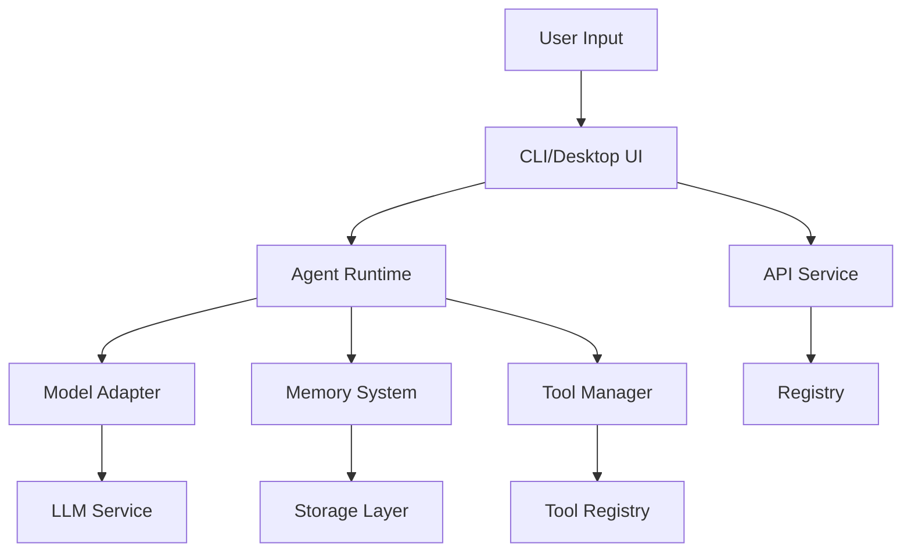

# SentinelStacks Architecture

This document outlines the architecture and implementation status of SentinelStacks, a platform for creating, running, and sharing AI agents.

## System Components and Implementation Status

### 1. Core Backend (✅ 85% Complete)

#### Model Adapters (✅ 100%)
- **Implementation Status**: Production Ready
- **Features**:
  - Unified `ModelAdapter` interface
  - OpenAI implementation (GPT-3.5, GPT-4)
  - Claude implementation (Claude 3)
  - Ollama integration (local models)
  - Configurable parameters (temperature, tokens, etc.)
  - Streaming support
  - Error handling and retries

#### Memory System (🔄 80%)
- **Implementation Status**: Near Complete
- **Features**:
  - Key-value storage implementation
  - Vector storage with embeddings
  - Persistence layer
  - Basic context management
- **Pending**:
  - Advanced context window optimization
  - Memory cleanup strategies
  - Performance optimizations
  - Extended test coverage

#### Tools Framework (✅ 90%)
- **Implementation Status**: Production Ready
- **Features**:
  - Extensible Tool interface
  - Built-in tools (Calculator, URLFetcher)
  - Parameter validation
  - Error handling
  - Tool registry system
- **Pending**:
  - Additional built-in tools
  - Tool marketplace integration

### 2. Frontend Components

#### Desktop Application (🚧 35%)
- **Implementation Status**: Early Development
- **Features**:
  - Tauri integration
  - React + TypeScript setup
  - Router configuration
  - Basic UI components
- **Pending**:
  - Agent management interface
  - Memory visualization
  - Settings management
  - Performance monitoring
  - Real-time updates

#### Registry UI (🚧 25%)
- **Implementation Status**: Early Development
- **Features**:
  - Basic layout and routing
  - Agent listing
  - Search interface
- **Pending**:
  - User authentication
  - Agent details view
  - Version management
  - Analytics dashboard

### 3. Infrastructure (✅ 90%)

#### API Service
- **Implementation Status**: Production Ready
- **Features**:
  - RESTful endpoints
  - Agent management
  - Registry operations
  - Authentication middleware
  - Rate limiting
  - CORS support

#### Deployment
- **Implementation Status**: Production Ready
- **Components**:
  - Nginx reverse proxy
  - Docker containers
  - PostgreSQL database
  - Redis cache
  - Registry storage

## Core Interfaces

### ModelAdapter Interface
```go
type ModelAdapter interface {
    Generate(prompt string, systemPrompt string, options Options) (string, error)
    GetCapabilities() ModelCapabilities
}

type ModelCapabilities struct {
    Streaming       bool
    FunctionCalling bool
    MaxTokens       int
    Multimodal      bool
}
```

### Tool Interface
```go
type Tool interface {
    ID() string
    Name() string
    Description() string
    Version() string
    ParameterSchema() map[string]interface{}
    Execute(params map[string]interface{}) (interface{}, error)
}
```

## Data Flow



## Security Measures

1. **Authentication**
   - API key management
   - Role-based access control
   - Session management

2. **Data Protection**
   - TLS encryption
   - Secure storage
   - API rate limiting

3. **Execution Safety**
   - Tool sandboxing
   - Resource limits
   - Input validation

## Performance Considerations

1. **Caching Strategy**
   - Redis for frequent operations
   - Memory caching for LLM responses
   - Registry artifact caching

2. **Optimization**
   - Batch operations
   - Connection pooling
   - Lazy loading

3. **Monitoring**
   - Performance metrics
   - Error tracking
   - Usage analytics

## Development Workflow

1. **Local Development**
   - Hot reloading
   - Development containers
   - Test environment

2. **Testing**
   - Unit tests
   - Integration tests
   - E2E testing
   - Performance benchmarks

3. **Deployment**
   - CI/CD pipeline
   - Docker compose
   - Environment management

## Next Steps

1. **High Priority**
   - Complete desktop UI implementation
   - Enhance memory system optimization
   - Implement user authentication
   - Add comprehensive testing

2. **Medium Priority**
   - Expand tool marketplace
   - Improve error handling
   - Add monitoring dashboard
   - Enhance documentation

3. **Low Priority**
   - Add advanced features
   - Optimize build pipeline
   - Create additional examples
   - Implement analytics

## Success Metrics

1. **Performance**
   - Response time < 100ms
   - Memory usage < 500MB
   - 99.9% uptime

2. **Quality**
   - Test coverage > 80%
   - Zero critical issues
   - < 1% error rate

3. **User Experience**
   - Setup time < 5 minutes
   - Intuitive interface
   - Clear documentation
