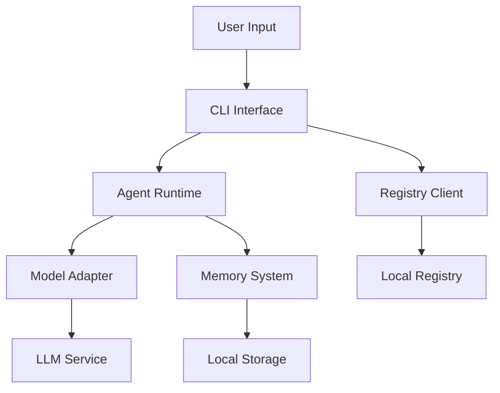

# SentinelStacks Architecture

This document outlines the architecture and implementation status of SentinelStacks, a platform for creating, running, and sharing AI agents.

## System Components and Implementation Status

### 1. CLI (`sentinel`) ✅
**Status: Production Ready**
- Command-line interface using Cobra framework
- Enhanced UI with animated progress indicators
- Color-coded output for better UX
- Implemented commands:
  - `agent`: Create and manage agents
  - `registry`: Interact with agent registry
  - `memory`: Manage agent memory
  - `version`: Version information

### 2. Model Adapters ✅
**Status: Production Ready**
- Unified interface for all LLM providers
- Implemented adapters:
  - OpenAI (GPT-3.5, GPT-4)
  - Anthropic Claude
  - Ollama (local models)
- Embedding support for vector storage
- Configurable model parameters

### 3. Memory System 🔄
**Status: Partially Complete (75%)**
- Implemented features:
  - Simple key-value storage
  - Vector-based storage
  - Basic persistence
- Pending features:
  - Context window management
  - Advanced retrieval mechanisms
  - Memory optimization
  - Comprehensive testing

### 4. Desktop Application 🚧
**Status: Early Development (25%)**
- Implemented features:
  - Basic Tauri setup
  - React project structure
- Pending features:
  - Agent management UI
  - Monitoring interface
  - Settings management
  - Performance metrics

### 5. Registry System 🚧
**Status: Early Development (15%)**
- Implemented features:
  - Basic UI structure
  - Simple file-based storage
- Pending features:
  - Backend API
  - User authentication
  - Version control
  - Search functionality

## Data Flow (Current Implementation)



## Key Interfaces

### Model Adapter Interface ✅
```go
type ModelAdapter interface {
    Generate(prompt string, systemPrompt string, options Options) (string, error)
    GetCapabilities() ModelCapabilities
    GetEmbedding(text string) ([]float32, error)
}
```

### Memory Interface 🔄
```go
type Memory interface {
    Add(content string, metadata map[string]interface{}) (string, error)
    Get(id string) (*MemoryEntry, error)
    Search(query string, limit int) ([]MemoryEntry, error)
    List(limit int) ([]MemoryEntry, error)
    Delete(id string) error
    Clear() error
}
```

### Agent Configuration ✅
```yaml
name: agent-name
version: "1.0.0"
description: "Agent description"
model:
  provider: "ollama"
  name: "llama2"
  options:
    temperature: 0.7
capabilities:
  - file_access
  - network_access
memory:
  type: "vector"
  persistence: true
  maxItems: 1000
```

## Current Deployment Architecture

### Phase 1: Local-First (Current) ✅
- File-based storage
- Local model support via Ollama
- CLI-first interface
- Basic agent persistence

### Phase 2: Registry (Planned) 🚧
- Remote registry service
- User authentication
- Version control
- Agent sharing

### Phase 3: Enterprise (Future) 📋
- Private registries
- Team management
- Audit logging
- Custom model hosting

## Testing Status

### Unit Tests 🔄
- Model adapters: 90% coverage
- Memory system: 60% coverage
- CLI commands: 40% coverage

### Integration Tests 🚧
- Basic CLI tests
- Memory persistence tests
- Pending: E2E testing

### Performance Tests 📋
- Not implemented yet
- Planned for core components

## Security Considerations

### Implemented ✅
- Basic file permissions
- Environment variable handling
- API key management

### In Progress 🔄
- Input validation
- Rate limiting
- Error handling

### Planned 📋
- Authentication system
- Audit logging
- Sandbox environments

## Known Limitations

1. Memory System
   - Limited context window management
   - Basic vector search implementation
   - No memory optimization

2. Desktop UI
   - Early development stage
   - Limited functionality
   - No real-time updates

3. Registry
   - Local-only functionality
   - No version control
   - Basic storage mechanisms

## Next Steps

1. Complete memory system implementation
2. Add comprehensive testing
3. Develop registry backend
4. Continue desktop UI development
