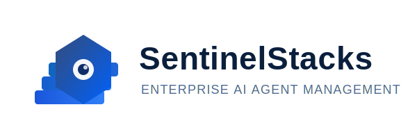

# SentinelStacks



SentinelStacks is an open-source AI agent management system that simplifies the creation, deployment, and management of AI agents across multiple LLM backends.

[](https://github.com/sentinelstacks/sentinel/actions/workflows/go-test.yml)
[](https://sentinelstacks.github.io/sentinel/)
[](https://github.com/sentinelstacks/sentinel/actions/workflows/docker.yml)
[](LICENSE)

## Features

- **Natural Language Agent Definition**: Define agents using simple YAML or natural language
- **Multi-LLM Support**: Run the same agent across different LLM backends (Claude, OpenAI, Ollama)
- **Agent Management**: Build, run, and manage agents with a simple CLI
- **State Management**: Define and maintain agent state between runs
- **Tool Integration**: Connect agents to external tools and APIs
- **Multi-agent Orchestration**: Create complex workflows with multiple agents
- **Registry System**: Store and share agents with your team
- **Multimodal Support**: Create agents that process and generate images alongside text

## Installation

### Binary Installation

```bash
# Download and install the latest release (coming soon)
curl -L https://install.sentinelstacks.dev | bash
```

### From Source

```bash
# Clone the repository
git clone https://github.com/sentinelstacks/sentinel.git
cd sentinel

# Build and install
go build -o sentinel ./cmd/sentinel
sudo mv sentinel /usr/local/bin/
```

### Via Docker

```bash
# Pull the latest image
docker pull sentinelstacks/sentinel:latest

# Run the container
docker run -it sentinelstacks/sentinel:latest
```

## Quick Start

```bash
# Create a new agent
sentinel create my-agent

# Edit the Sentinelfile
nano my-agent/Sentinelfile 

# Build the agent
sentinel build my-agent

# Run the agent
sentinel run my-agent
```

## Example Sentinelfile

```yaml
name: SimpleAgent
description: A simple assistant that helps answer questions
baseModel: claude-3-haiku-20240307
capabilities:
  - Answer general knowledge questions
  - Maintain a friendly, helpful tone
  - Remember context from the conversation
parameters:
  temperature: 0.7
  responseLength: medium
```

## Multimodal Support

SentinelStacks now supports multimodal capabilities, allowing agents to process and generate visual content:

```yaml
name: VisualAnalysisAgent
description: An agent that analyzes images
baseModel: claude-3-opus-20240229
multimodal:
  enabled: true
  supportedMediaTypes:
    - image/jpeg
    - image/png
  imageAnalysisFeatures:
    - objectDetection
    - textRecognition
```

Run a multimodal agent with an image:

```bash
# Run a visual analysis agent with an image
sentinel run visual-agent --image path/to/image.jpg --prompt "What's in this image?"
```

## Documentation

For comprehensive documentation, visit [SentinelStacks Documentation](https://sentinelstacks.github.io/sentinel/).

- [Architecture Overview](https://sentinelstacks.github.io/sentinel/architecture/)
- [User Guides](https://sentinelstacks.github.io/sentinel/user-guides/)
- [Example Agents](https://sentinelstacks.github.io/sentinel/examples/)
- [Development Roadmap](https://sentinelstacks.github.io/sentinel/planning/roadmap/)
- [Multimodal Support](https://sentinelstacks.github.io/sentinel/features/multimodal/)

## Example Agents

SentinelStacks includes several example agents to help you get started:

- **chatbot**: Basic conversational agent
- **translator**: Language translation agent
- **codehelper**: Programming assistance agent
- **visualanalysis**: Image analysis agent (multimodal)

## CLI Implementation

SentinelStacks provides a powerful command-line interface inspired by Docker's workflow. The CLI allows you to manage agents through their entire lifecycle.

### Available Commands

```
Usage:
  sentinel [command]

Available Commands:
  build       Build a Sentinel Image from a Sentinelfile
  config      Manage SentinelStacks configuration
  images      List Sentinel Images
  init        Initialize a new Sentinelfile
  logs        View logs from an agent
  ps          List running agents
  run         Run a Sentinel Agent from an image
  stop        Stop a running agent
  version     Print version information
```

### Examples

#### Initialize a new Sentinelfile
```bash
sentinel init --template chatbot
```

#### Build an agent from a Sentinelfile
```bash
sentinel build -t myuser/chatbot:latest
```

#### List available agent images
```bash
sentinel images
```

#### Run an agent
```bash
sentinel run myuser/chatbot:latest
```

#### List running agents
```bash
sentinel ps
```

#### Stop a running agent
```bash
sentinel stop <agent_id>
```

#### View agent logs
```bash
sentinel logs <agent_id>
```

## Key Features

- **Natural Language Agent Definitions**: Define agents using simple, human-readable YAML files called Sentinelfiles.
- **Docker-like Workflow**: Build, run, share, and manage agents with a familiar command structure.
- **Extensible Provider System**: Support for multiple LLM providers through a unified interface.
- **Multimodal Support**: Process and generate text, images, and other media types depending on model capabilities.
- **Agent Registry**: Share and discover agents through a central registry.
- **Local Development**: Develop and test agents locally before sharing.
- **CLI & API Access**: Choose between command-line and programmatic interfaces.

## Documentation

Comprehensive documentation is available in the [docs](./docs) directory, including:

- [User Guides](./docs/user-guides)
- [Development Guides](./docs/development)
- [Architecture](./docs/architecture)
- [API Reference](./docs/architecture/api.md)

## Contributing

Contributions are welcome! Please see [CONTRIBUTING.md](./CONTRIBUTING.md) for details.

## License

This project is licensed under the MIT License - see the [LICENSE](./LICENSE) file for details.
