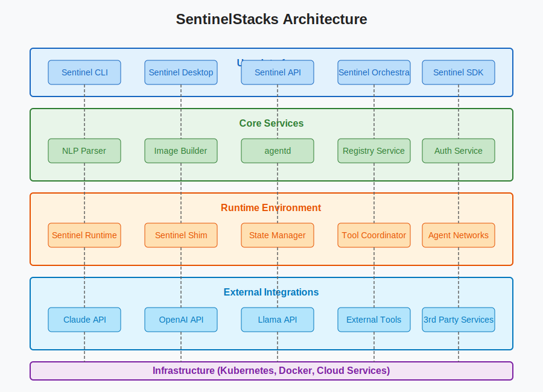

# SentinelStacks Architecture

## System Overview

SentinelStacks is built as a modular system with clear separation of concerns, directly inspired by Docker's architecture. This design enables flexibility, extensibility, and a familiar experience for users already acquainted with container technologies.

## Core Components

### 1. CLI Tool (sentinel)

The command-line interface serves as the primary interaction point for most users. It provides commands to:

- Initialize new agent definitions (`sentinel init`)
- Build agent images from Sentinelfiles (`sentinel build`)
- Run agents (`sentinel run`)
- Manage the agent lifecycle (`sentinel stop`, `sentinel restart`)
- Push/pull agents to/from registries (`sentinel push`, `sentinel pull`)

### 2. Sentinel Desktop

The graphical interface provides visualization and management capabilities:

- Visual agent builder with NLP input
- Agent monitoring and logs
- Registry browsing and management
- Performance metrics and analytics

### 3. Parser Service

Translates natural language Sentinelfiles into structured agent definitions:
- Leverages LLMs to understand intent and requirements
- Validates parsed definitions against original specifications
- Handles versioning and compatibility

### 4. Runtime Environment

Executes agents with the specified capabilities:
- Manages agent lifecycle (initialization, execution, termination)
- Handles state persistence
- Provides tool access and permission management
- Orchestrates multi-agent interactions

### 5. Sentinel Shim

Abstracts LLM provider differences:
- Normalizes inputs/outputs across different models
- Handles provider-specific optimizations
- Manages context windows and token limits
- Provides fallback mechanisms

### 6. Registry Service

Stores and distributes agent definitions:
- Versioning and tagging support
- Access control and authentication
- Search and discovery functions
- Metadata and documentation storage

## Data Flow

1. User creates a Sentinelfile in natural language
2. Parser converts the NLP into a structured agent definition
3. Builder packages the definition into a Sentinel Image
4. Runtime loads the image and initializes an agent
5. Shim handles communication with the appropriate LLM provider
6. State Manager maintains agent state across executions

## Security Model

- Role-based access control for registries
- Isolated execution environments for agents
- Capability-based permission model for tools
- Audit logging for all operations
- Encrypted communication between components

## Scalability Approach

- Stateless components for horizontal scaling
- Distributed state management
- Eventual consistency for registry operations
- Caching at multiple levels
