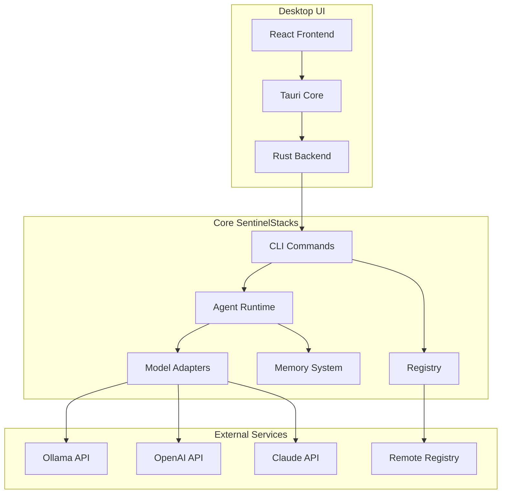

# SentinelStacks Desktop UI Implementation Plan

This document outlines the detailed plan for implementing the Tauri-based desktop UI for SentinelStacks.

## Architecture Overview

The desktop UI will use Tauri (Rust) as the backend with React and TypeScript for the frontend. This architecture provides native performance while leveraging web technologies for the UI.



## Implementation Phases

### Phase 1: Tauri Setup & Basic Structure (2 weeks)

1. **Initialize Tauri Project**
   - Set up a new Tauri project with React and TypeScript
   - Configure the build system and development workflow
   - Set up project structure

2. **Create Core UI Components**
   - Implement layout components (sidebar, header, etc.)
   - Build the theme system (light/dark mode)
   - Create reusable UI components (buttons, cards, tables)

3. **Implement Navigation**
   - Set up routing between main sections
   - Create the sidebar navigation
   - Implement tab navigation within sections

4. **Rust Backend Integration**
   - Create Rust commands for core functionality
   - Set up communication between React and Rust
   - Implement error handling and logging

### Phase 2: Agent Management (3 weeks)

1. **Agent Listing Page**
   - Implement the agent cards view
   - Create "Create Agent" functionality
   - Add filtering and search capabilities

2. **Agent Detail View**
   - Build the agent detail page with tabs
   - Implement the chat interface
   - Create the configuration editing UI
   - Add logs and memory viewing

3. **Agent Creation Workflow**
   - Implement agent creation wizard
   - Add model selection UI
   - Create capabilities and tools configuration
   - Implement the natural language to YAML conversion

4. **Agent Execution**
   - Build the agent execution runtime in the UI
   - Implement real-time execution monitoring
   - Create the streaming response handling
   - Add execution history recording

### Phase 3: Registry Integration (2 weeks)

1. **Registry Browsing**
   - Implement the registry listing page
   - Create search and filtering
   - Add sorting and categorization

2. **Registry Management**
   - Build the agent publishing workflow
   - Implement agent installation
   - Create version management UI
   - Add authentication and user management

3. **Offline Support**
   - Implement local registry cache
   - Create synchronization mechanism
   - Add offline mode indicators

### Phase 4: Advanced Features & Polish (3 weeks)

1. **Settings Management**
   - Implement settings UI
   - Create API key management
   - Add application preferences

2. **Analytics Dashboard**
   - Build usage statistics visualization
   - Create performance monitoring UI
   - Implement resource utilization charts

3. **Performance Optimization**
   - Optimize rendering performance
   - Improve startup time
   - Reduce memory usage

4. **Final Polish & Testing**
   - Comprehensive testing across platforms
   - Accessibility improvements
   - UX refinements
   - Keyboard shortcuts and power user features

## Technical Implementation Details

### React Frontend Structure

```
src/
├── assets/          # Static assets
├── components/      # Reusable UI components
│   ├── layout/      # Layout components
│   ├── agents/      # Agent-related components
│   ├── registry/    # Registry-related components
│   └── ui/          # Generic UI components
├── hooks/           # Custom hooks
├── pages/           # Main pages
├── services/        # API integration
├── store/           # State management
├── types/           # TypeScript types
└── utils/           # Utility functions
```

### Rust Backend Structure

```
src-tauri/
├── src/
│   ├── main.rs      # Entry point
│   ├── agent.rs     # Agent management
│   ├── registry.rs  # Registry integration
│   ├── memory.rs    # Memory system
│   └── config.rs    # Configuration management
├── Cargo.toml       # Dependencies
└── tauri.conf.json  # Tauri configuration
```

### State Management

We'll use React Context and custom hooks for state management:

```typescript
// src/store/AgentContext.tsx
import React, { createContext, useContext, useReducer } from 'react';
import { Agent } from '../types';

interface AgentState {
  agents: Agent[];
  activeAgent: Agent | null;
  loading: boolean;
  error: string | null;
}

const AgentContext = createContext<{
  state: AgentState;
  dispatch: React.Dispatch<AgentAction>;
} | undefined>(undefined);

export const useAgentStore = () => {
  const context = useContext(AgentContext);
  if (context === undefined) {
    throw new Error('useAgentStore must be used within an AgentProvider');
  }
  return context;
};

// Reducer, actions, and provider implementation...
```

### Tauri Commands

```rust
// src-tauri/src/agent.rs
#[tauri::command]
pub async fn list_agents() -> Result<Vec<Agent>, String> {
    // Implementation to list agents using the CLI library
}

#[tauri::command]
pub async fn create_agent(name: String, description: String, model: String, memory_type: String) -> Result<Agent, String> {
    // Implementation to create an agent using the CLI library
}

#[tauri::command]
pub async fn run_agent(name: String, version: String) -> Result<(), String> {
    // Implementation to run an agent using the CLI library
}

#[tauri::command]
pub async fn execute_agent_command(name: String, input: String) -> Result<String, String> {
    // Implementation to execute a command with an agent
}
```

## User Experience Considerations

1. **Onboarding Flow**
   - First-time user experience with guided tour
   - Sample agents for quick start
   - Tooltips and help documentation

2. **Error Handling**
   - Clear error messages
   - Guided recovery steps
   - Offline capabilities

3. **Performance**
   - Lazy loading of heavy components
   - Virtual scrolling for large lists
   - Background processing for intensive tasks

4. **Accessibility**
   - Keyboard navigation
   - Screen reader support
   - Color contrast compliance
   - Focus management

## Development Workflow

1. **Setup Development Environment**
   ```bash
   # Create a new Tauri project
   npm create tauri-app@latest sentinel-desktop
   cd sentinel-desktop
   
   # Install dependencies
   npm install
   
   # Development mode
   npm run tauri dev
   ```

2. **Testing Strategy**
   - Unit tests for React components
   - Integration tests for Tauri commands
   - End-to-end tests for critical workflows

3. **Continuous Integration**
   - GitHub Actions for automated testing
   - Automated builds for all platforms
   - Release automation

## Detailed Task Breakdown

Here's a week-by-week task breakdown for implementing the desktop UI:

### Week 1: Initial Setup
- Day 1-2: Set up Tauri project structure and build system
- Day 3-4: Create basic React application structure
- Day 5: Implement theme system and basic styling

### Week 2: Core UI Framework
- Day 1-2: Implement sidebar navigation and main layout
- Day 3-4: Create reusable UI components library
- Day 5: Set up routing and navigation state

### Week 3: Agent Listing
- Day 1-2: Implement agent listing page and card components
- Day 3-4: Create filtering and search functionality
- Day 5: Add sorting and categorization

### Week 4: Agent Detail View
- Day 1-2: Implement agent detail page with tabs
- Day 3-4: Create chat interface and execution environment
- Day 5: Add logs and memory viewing

### Week 5: Agent Creation
- Day 1-2: Implement agent creation wizard
- Day 3-4: Create model selection and configuration UI
- Day 5: Add validation and error handling

### Week 6: Agent Execution
- Day 1-2: Build agent execution runtime in the UI
- Day 3-4: Implement streaming responses and real-time updates
- Day 5: Add execution history and state persistence

### Week 7: Registry Integration
- Day 1-3: Implement registry browsing and search
- Day 4-5: Create agent installation workflow

### Week 8: Registry Management
- Day 1-2: Build agent publishing workflow
- Day 3-4: Add version management and update checking
- Day 5: Implement authentication and user management

### Week 9: Settings & Configuration
- Day 1-2: Create settings UI and preferences management
- Day 3-4: Implement API key management
- Day 5: Add application configuration and persistence

### Week 10: Polish & Refinement
- Day 1-2: Performance optimization
- Day 3-4: Accessibility improvements
- Day 5: UX refinements and fixes

## Getting Started - First Steps

To begin implementing the desktop UI, here are the concrete first steps:

1. **Initial Project Setup**

```bash
# Create the Tauri project
npm create tauri-app@latest sentinel-desktop -- --template react-ts

# Navigate to the project
cd sentinel-desktop

# Install additional dependencies
npm install react-router-dom tailwindcss @headlessui/react

# Initialize Tailwind CSS
npx tailwindcss init

# Start development mode
npm run tauri dev
```

2. **Configure Tailwind CSS**

```javascript
// tailwind.config.js
module.exports = {
  content: ["./src/**/*.{js,jsx,ts,tsx}"],
  darkMode: 'class',
  theme: {
    extend: {
      colors: {
        primary: {
          50: '#E6F7F9',
          100: '#CCEFF4',
          200: '#99DFE9',
          300: '#66CFDE',
          400: '#33BFD3',
          500: '#00AFC8',
          600: '#008BA0',
          700: '#006878',
          800: '#004450',
          900: '#002228',
        },
      },
    },
  },
  plugins: [],
}
```

3. **Create Basic Folder Structure**

```bash
mkdir -p src/{components,pages,store,types,utils,hooks,assets,services}
mkdir -p src/components/{layout,agents,registry,ui}
```

4. **Implement Main Layout Component**

```tsx
// src/components/layout/MainLayout.tsx
import React, { useState } from 'react';
import Sidebar from './Sidebar';
import Header from './Header';

interface MainLayoutProps {
  children: React.ReactNode;
}

const MainLayout: React.FC<MainLayoutProps> = ({ children }) => {
  const [darkMode, setDarkMode] = useState(false);
  
  return (
    <div className={`h-screen flex flex-col ${darkMode ? 'dark' : ''}`}>
      <Header toggleDarkMode={() => setDarkMode(!darkMode)} />
      <div className="flex-1 flex overflow-hidden">
        <Sidebar />
        <main className="flex-1 overflow-auto bg-slate-100 dark:bg-slate-900">
          {children}
        </main>
      </div>
    </div>
  );
};

export default MainLayout;
```

## Conclusion

This implementation plan provides a comprehensive roadmap for building the SentinelStacks desktop UI. By following this structured approach, we can ensure a consistent and high-quality user experience while maintaining efficient development progress.
