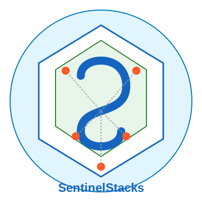

# SentinelStacks Documentation



## AI Agent Management System

SentinelStacks is a comprehensive system for creating, managing, and distributing AI agents using natural language. Built with inspiration from Docker's paradigm, SentinelStacks allows you to:

- Define agents using natural language in Sentinelfiles
- Build agent images that can be versioned and shared
- Run agents across different LLM backends (Claude, OpenAI, Llama, etc.)
- Manage agent state and orchestrate multi-agent systems
- Share agents through public and private registries

## Getting Started

```bash
# Install SentinelStacks
go install github.com/sentinelstacks/sentinel@latest

# Create your first agent
sentinel init --name my-first-agent

# Edit the Sentinelfile
nano my-first-agent/Sentinelfile

# Build your agent
sentinel build -t my-username/my-first-agent:latest -f my-first-agent/Sentinelfile

# Run your agent
sentinel run my-username/my-first-agent:latest
```

## Core Concepts

| Concept | Description |
|---------|-------------|
| Sentinelfile | NLP-based definition file for agents |
| Sentinel Image | Packaged agent definition with dependencies |
| Sentinel Agent | Running instance of an agent |
| Sentinel Registry | Repository for storing and sharing agent images |
| Sentinel Runtime | Execution environment for agents |
| Sentinel Shim | Abstraction layer for LLM providers |

## Documentation Sections

- [Architecture Overview](architecture/README.md) - Understand the system architecture
- [User Guides](user-guides/README.md) - Learn how to use SentinelStacks
- [Quick Start](user-guides/quick_start.md) - Get up and running quickly
- [LLM Providers](user-guides/llm_providers.md) - Configure different LLM backends
- [Advanced Agents](user-guides/advanced_agents.md) - Design sophisticated agent systems
- [Development Roadmap](planning/roadmap.md) - See what's planned for the future

## Example Agents

SentinelStacks includes several example agents to help you get started:

- [Basic Chatbot](examples/chatbot.md) - A simple conversational agent
- [Research Assistant](examples/research-assistant.md) - Advanced research and information synthesis
- [Team Collaboration](examples/team-collaboration.md) - Multi-agent system with specialized roles
- [Financial Advisor](examples/finance-advisor.md) - Financial planning with compliance controls
- [NLP Generator](examples/nlp-generator.md) - Create agents on-the-fly using natural language

## Supported LLM Providers

SentinelStacks currently supports:

- **Claude** - Anthropic's Claude models (Claude 3 Opus, Sonnet, Haiku)
- **Ollama** - Self-hosted models via Ollama (Llama, Mistral, etc.)
- **OpenAI** - Support planned (Coming soon)

## Project Status

SentinelStacks is currently in active development. See our [Progress Tracker](planning/progress_tracker.md) for the current status and our [Roadmap](planning/roadmap.md) for planned features.

## License

MIT 