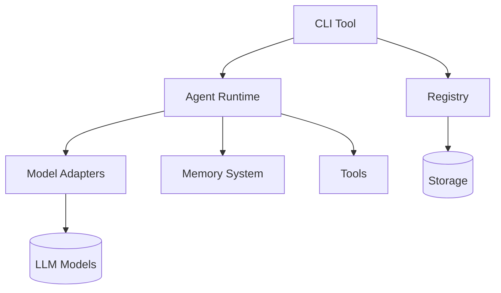

# SentinelStacks Documentation

Welcome to the official documentation for SentinelStacks, the AI-powered infrastructure management platform.

## What is SentinelStacks?

SentinelStacks is a platform that helps organizations automate, secure, and manage their cloud resources using intelligent agents. It provides a unified interface for creating, running, and sharing AI agents that can manage infrastructure, perform tasks, and solve problems.


## Key Features

- **🤖 AI-Powered Automation**: Intelligent agents that understand your infrastructure
- **🧠 Advanced Memory System**: Vector and simple memory options for enhanced agent capabilities
- **🔒 Security First**: Built-in security features and compliance checks
- **☁️ Multi-Cloud Support**: Manage resources across multiple cloud providers
- **🔌 Extensible Platform**: Create and share custom agents
- **🛠️ Custom Tools**: Extend agents with specialized tools

## Getting Started

To get started with SentinelStacks, follow these steps:

1. [Install SentinelStacks](getting-started/installation.md)
2. [Create your first agent](getting-started/first-agent.md)
3. [Explore the command reference](user-guide/command-reference.md)

## Quick Example

```bash
# Create a new agent
sentinel agent create --name my-first-agent --description "My first AI agent" --model llama3 --memory vector

# Run the agent in interactive mode
sentinel agent run --name my-first-agent --interactive
```

## Components

SentinelStacks consists of several core components:

- **CLI**: Command-line interface for creating and running agents
- **Agent Runtime**: Executes agents based on configuration
- **Model Adapters**: Connects to various LLM providers (Ollama, OpenAI, Claude)
- **Memory System**: Persists agent state and context
- **Registry**: Stores and shares agent definitions
- **Desktop UI**: Visual interface for managing agents (coming soon)

## Architecture

For a detailed overview of SentinelStacks architecture, see the [Architecture Overview](architecture/overview.md).


```mermaid
flowchart TB
    CLI[CLI Tool] --> AgentRuntime[Agent Runtime]
    CLI --> Registry[Registry]
    AgentRuntime --> Adapters[Model Adapters]
    AgentRuntime --> Memory[Memory System]
    AgentRuntime --> Tools[Tools]
    Adapters --> Models[(LLM Models)]
    Registry --> Storage[(Storage)]
```

## Further Reading

- [Agentfile Reference](user-guide/agentfile.md): Learn how to configure agents
- [Memory System](memory/memory-system.md): Understand how agent memory works
- [Desktop UI Plan](desktop-ui/implementation-plan.md): Preview the upcoming desktop application

## Support

If you need help with SentinelStacks, you can:

- [Open an issue](https://github.com/satishgonella2024/sentinelstacks/issues)
- [Join our Discord community](https://discord.gg/sentinelstacks)
- [Contact the team](mailto:support@sentinelstacks.io)
